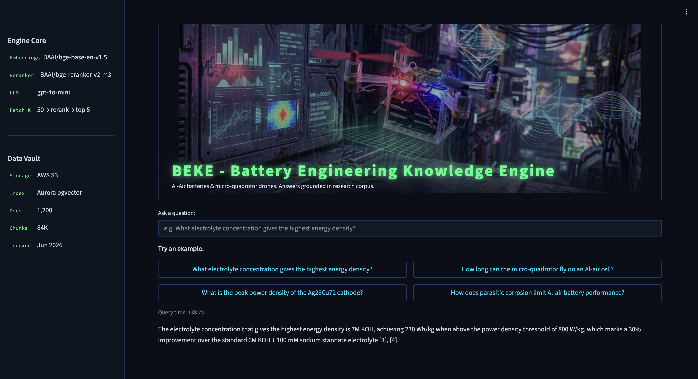

# ⚡ BEKE — Battery Engineering Knowledge Engine

A production RAG system for semantic search over a multi-modal PhD research corpus (1,200 Word, PowerPoint, and PDF documents). Ask a natural-language question about aluminum-air batteries and micro-quadrotor drones — get a grounded answer with source citations and one-click file downloads.



**Live demo:** [http://184.72.59.84:8501](http://184.72.59.84:8501) — log in or browse as a guest (3 queries/day).

---

## Architecture

BEKE has **two pipelines**. The indexing pipeline runs once, offline, to build the searchable index; the query pipeline runs on every request. Keeping them separate is important — contextual enrichment, for example, happens at index time and is frozen into the stored vectors, so it never runs at query time.

### Indexing pipeline (offline, run once by `ingest.py`)

```
S3 corpus
    │
    ▼
Ingestion        parse .docx / .pdf (native) · .pptx (native + vision)
    │
    ▼
Chunking         recursive splitter, 1000 chars / 150 overlap
    │
    ▼
Contextual       gpt-4o-mini prepends 1–2 situating sentences per chunk
enrichment       (Anthropic-style contextual retrieval, cached)
    │
    ▼
Embedding        BGE-base-en-v1.5 → 768-dim vector per chunk
    │
    ▼
Storage          upsert to Aurora pgvector (collection "beke_contextual", 84K chunks)
```

### Query pipeline (per request, served by `app.py`)

```
User query
    │
    ▼
Embedding              BGE-base-en-v1.5 (same model as indexing)
    │
    ▼
Dense retrieval        fetch top-50 from Aurora pgvector  (dense-only first stage)
    │
    ▼
Cross-encoder rerank   bge-reranker-v2-m3 re-scores → keep top-5
    │
    ▼
Generation             gpt-4o-mini → grounded answer + inline citations
```

> **Index-time vs query-time:** "contextual chunks" is an indexing step baked into the stored vectors — the query path is simply `embed → dense retrieve → rerank → generate`. The deployed first stage is **dense-only**; the offline benchmark additionally used a hybrid BM25 stage (see [§3.6](#36-retrieval)).

### Infrastructure


| Component      | Service                                                 |
| -------------- | ------------------------------------------------------- |
| Corpus storage | S3                                                      |
| Vector index   | Aurora PostgreSQL Serverless v2 + pgvector (84K chunks) |
| Web app        | EC2 t3.medium, Streamlit, Docker                        |
| Embeddings     | BGE-base-en-v1.5 (local, CPU)                           |
| Reranker       | BGE-reranker-v2-m3 (local, CPU)                         |
| LLM            | gpt-4o-mini (API)                                       |


---

## Pipeline Design Choices

Each stage was selected through a structured bake-off: every option below was implemented and compared on the same eval set before picking a production winner. Tables list the approaches considered, with the stepwise mechanics, trade-offs, and the production verdict.

### 3.1 Ingestion


| ID  | Approach     | What it is (steps)                                                                                                                                                                                                                                     | Advantages                                                                     | Disadvantages                                                                 | Production?        |
| --- | ------------ | ------------------------------------------------------------------------------------------------------------------------------------------------------------------------------------------------------------------------------------------------------ | ------------------------------------------------------------------------------ | ----------------------------------------------------------------------------- | ------------------ |
| 1A  | Unstructured | (1) call `partition_docx/pptx/pdf`; (2) returns a flat list of typed elements (Title, NarrativeText, Image, Table); (3) map each category to a section label; (4) skip Image elements; (5) emit text + metadata.                                       | One API across all formats; rich element categories                            | Heavier dependency; slower; less structural control; overkill for clean files | ❌                  |
| 1B  | Native       | (1) route by extension; (2) `.docx`→python-docx walks paragraphs + headings, `.pdf`→PyMuPDF/pypdf extracts text layer per page, `.pptx`→python-pptx iterates shapes + speaker notes; (3) record heading path, page/slide idx; (4) emit ParsedSections. | Fast; lightweight; precise structure; fully local (privacy)                    | No understanding of images/charts — figures lost as text                      | ✅ **.docx + .pdf** |
| 1C  | Vision       | (1) extract text natively as in 1B; (2) render each embedded image/chart; (3) send to gpt-4o-mini with a "describe this figure" prompt; (4) capture the description as text; (5) merge with native text so figures become searchable.                  | Recovers figure/chart content (SEM scans, voltage curves) native parsing drops | Cost + latency per image (~$0.20–$2.00 for 124 PPTX); content sent to LLM     | ✅ **.pptx**        |


### 3.2 Chunking

Benchmarked on the AgCathode manuscript, 20-question eval, same dense retriever (BGE + Chroma) to isolate the variable.


| ID  | Approach                               | What it is (steps)                                                                                                                                                                                                     | Advantages                                                                                  | Disadvantages                                                                                                              | Hit@1    | Production? |
| --- | -------------------------------------- | ---------------------------------------------------------------------------------------------------------------------------------------------------------------------------------------------------------------------- | ------------------------------------------------------------------------------------------- | -------------------------------------------------------------------------------------------------------------------------- | -------- | ----------- |
| 2A  | Recursive (1000/150)                   | (1) walk the text; (2) cut every ~1000 chars at the nearest clean boundary — paragraph, else sentence, else word; (3) overlap each chunk with the next by 150 chars. Text in, text out — no model.                     | Deterministic/reproducible; holds a complete scientific claim; overlap keeps boundary terms | Boundaries ignore topic structure                                                                                          | 0.55     | ✅           |
| 2B  | Semantic (percentile 80)               | (1) split into sentences; (2) embed each (optionally + neighbors); (3) cosine similarity between adjacent pairs; (4) take the 80th-percentile of all "drops" as threshold; (5) cut only at drops sharper than that.    | Topic-aware in theory; won this isolated test                                               | Non-deterministic; scientific prose has no clean breaks → tiny (237) or oversized (1484) chunks; variance hurts downstream | **0.65** | ❌           |
| 2C  | Hierarchical (child 400 / parent 2000) | (1) split into large parents (~2000, no overlap); (2) split each into small children (400/50); (3) embed only the children; (4) keep parent text on each child; (5) match on children, but hand the parent to the LLM. | Small unit for precise matching; large unit gives the LLM rich context                      | Children too small to embed reliably → weak retrieval; helps generation, not finding                                       | 0.60     | ❌           |


### 3.3 Contextual Enrichment


| Option                | What it is (steps)                                                                                                                                                                                        | Advantages                                                                                                                                 | Disadvantages                                                                         | Production? |
| --------------------- | --------------------------------------------------------------------------------------------------------------------------------------------------------------------------------------------------------- | ------------------------------------------------------------------------------------------------------------------------------------------ | ------------------------------------------------------------------------------------- | ----------- |
| Index-time enrichment | (1) at ingest, gpt-4o-mini writes 1–2 sentences situating each chunk in its document; (2) prepend to chunk text; (3) embed the enriched text; (4) cache results to JSONL. Frozen into the stored vectors. | Bridges vocabulary gaps BM25 and dense both miss → resolved the final benchmark miss (Hit@1 1.00); ~$1–3 one-time; $0 on re-runs via cache | Slightly dilutes precision on already-correct chunks (longer text); one-time LLM cost | ✅           |
| No enrichment         | Embed raw chunks directly.                                                                                                                                                                                | Simplest; no LLM cost                                                                                                                      | Leaves the vocabulary-gap miss unresolved (caps at Hit@1 0.97)                        | ❌           |
| Query-time enrichment | Generate context per chunk at retrieval time.                                                                                                                                                             | Always fresh                                                                                                                               | Wasteful and slow — recomputes the same context every query                           | ❌           |


### 3.4 Embedding


| Option                | What it is                                                                                         | Advantages                                                                                                                    | Disadvantages                                             | Production? |
| --------------------- | -------------------------------------------------------------------------------------------------- | ----------------------------------------------------------------------------------------------------------------------------- | --------------------------------------------------------- | ----------- |
| BAAI/bge-base-en-v1.5 | 768-dim bi-encoder; normalized embeddings; runs locally on CPU; same model for chunks and queries. | Strong on scientific/technical English; 768-dim balances expressiveness vs storage/compute; normalized → cosine = dot product | Heavier than MiniLM on CPU                                | ✅           |
| all-MiniLM-L6-v2      | 384-dim lightweight bi-encoder.                                                                    | Smaller, faster, less memory                                                                                                  | Weaker on scientific/technical text — the deciding factor | ❌           |
| Larger BGE variants   | e.g. bge-large (1024-dim).                                                                         | Marginally higher quality                                                                                                     | More compute/latency for marginal gain on a CPU-bound box | ❌           |


### 3.5 Storage / Vector Index


| Option                | What it is                                                                                | Advantages                                                                                                            | Disadvantages                                           | Production?     |
| --------------------- | ----------------------------------------------------------------------------------------- | --------------------------------------------------------------------------------------------------------------------- | ------------------------------------------------------- | --------------- |
| Aurora pgvector       | PostgreSQL Serverless v2 + pgvector extension (collection `beke_contextual`, 84K chunks). | Scales to near-zero idle; familiar SQL; native LangChain `PGVector`; AWS-native billing; fully private (bastion-only) | Cold-start latency on first query after idle            | ✅               |
| OpenSearch Serverless | Managed search + vector engine.                                                           | Built-in BM25 + vectors                                                                                               | ~$175/mo floor — overkill; no BM25 needed at serve time | ❌               |
| Pinecone              | Managed vector DB.                                                                        | Turnkey, fast                                                                                                         | ~$70+/mo; off-AWS, separate billing                     | ❌               |
| Chroma                | Local embedded vector store.                                                              | Zero setup; great for dev                                                                                             | Not a shared production service                         | ✅ dev/test only |


### 3.6 Retrieval

Benchmarked on 5 files, 30-question eval set, with 2A chunks.


| ID  | Approach               | What it is (steps)                                                                                                                                     | Advantages                                                           | Disadvantages                                     | Hit@1 / MRR     | Production?        |
| --- | ---------------------- | ------------------------------------------------------------------------------------------------------------------------------------------------------ | -------------------------------------------------------------------- | ------------------------------------------------- | --------------- | ------------------ |
| 3A  | Dense only             | (1) embed query (BGE); (2) cosine kNN over stored vectors; (3) return top-k.                                                                           | Simple; good recall (Hit@5 = 1.0)                                    | Blurs exact chemical terms / model names / values | 0.60 / 0.76     | Baseline           |
| 3B  | Hybrid BM25 + dense    | (1) BM25 keyword search → list A; (2) dense vector search → list B; (3) fuse via Reciprocal Rank Fusion (1/(k+rank)); (4) dense_weight 0.5; (5) top-k. | BM25 fixes vocabulary-gap misses (+20pp)                             | Still ranking-only; needs an in-memory BM25 index | 0.80 / 0.89     | Benchmark only     |
| 3C  | + cross-encoder rerank | (1) top-50 from first stage; (2) pair query with each candidate; (3) bge-reranker-v2-m3 scores each pair; (4) sort; (5) top-k.                         | Full (query,passage) attention pushes best chunk to rank 1 (+17pp)   | ~0.5s/query compute                               | 0.97 / 0.98     | ✅ component        |
| 3D  | + multi-query          | (1) LLM writes 3 paraphrases; (2) run 3C per paraphrase; (3) merge + dedupe; (4) rerank union; (5) top-k.                                              | Can explore more of embedding space                                  | No gain over 3C here; extra LLM cost/latency      | 0.97 / 0.98     | ❌                  |
| 3E  | + contextual chunks    | (1) index-time: enrich chunks before embedding (§3.3); (2) at query time run the first stage → rerank over those contextual chunks.                    | Resolves the last miss by supplying missing vocabulary at index time | Longer text slightly dilutes precision            | **1.00 / 1.00** | ✅ benchmark winner |


> **Deployed pipeline:** contextual index (§3.3) → **dense-only** first stage (pgvector, k=50) → cross-encoder rerank (3C) → top-5. The in-memory BM25/hybrid stage (3B) was dropped at deploy time — rebuilding it per stateless container wasn't worth the ops cost, and contextual enrichment already covers most of its vocabulary-gap benefit.

### 3.7 Generation


| Option                       | What it is                                                                                                                                                                  | Advantages                                                                                | Disadvantages                            | Production? |
| ---------------------------- | --------------------------------------------------------------------------------------------------------------------------------------------------------------------------- | ----------------------------------------------------------------------------------------- | ---------------------------------------- | ----------- |
| gpt-4o-mini                  | (1) take top-5 reranked chunks; (2) fill a grounded prompt that cites by passage number; (3) generate at temperature 0; (4) fall back to "I don't have enough information." | Fast, cheap, high quality; deterministic; returns provenance for citations + S3 downloads | External API (data leaves VPC)           | ✅           |
| Bedrock Claude Haiku         | Same prompt via AWS Bedrock.                                                                                                                                                | Keeps traffic in-VPC (data residency)                                                     | Slightly higher per-query cost           | ◻ fallback  |
| Larger models (GPT-4o, etc.) | Higher-capacity generation.                                                                                                                                                 | Marginally stronger reasoning                                                             | Unnecessary cost for grounded extraction | ❌           |


---

## Evaluation

### Retrieval Ablation (30-question eval set)

Five retriever configurations evaluated on the same eval set and chunks. Each row adds one technique on top of the previous.


| #      | Retriever               | Hit@1    | MRR      | nDCG@5   |
| ------ | ----------------------- | -------- | -------- | -------- |
| 3A     | Dense only              | 0.60     | 0.76     | 0.83     |
| 3B     | + BM25 hybrid           | 0.80     | 0.89     | 0.91     |
| 3C     | + cross-encoder rerank  | 0.97     | 0.98     | 0.97     |
| 3D     | + multi-query           | 0.97     | 0.98     | 0.97     |
| **3E** | **+ contextual chunks** | **1.00** | **1.00** | **0.98** |


**Key takeaways:**

- **BM25 hybrid (+20pp Hit@1):** Chemical terms like "Al(OH)₄⁻", "ECSA", and measurement values that dense embeddings blurred were matched exactly by BM25. Single largest gain. *(This stage informs the benchmark winner; the deployed service runs dense-only — see §3.6.)*
- **Cross-encoder rerank (+17pp):** The correct chunk was already in top-50 but poorly ranked. Full (query, passage) attention pushed it to rank 1.
- **Multi-query (+0pp):** LLM paraphrases didn't explore a sufficiently different embedding region — the remaining miss was a ranking problem, not a phrasing problem.
- **Contextual enrichment (+3pp to perfect):** LLM-generated context supplied the missing vocabulary at index time, resolving the final failure case.

### Answer Quality (RAGAS, 5-question subset)


| Metric            | Score |
| ----------------- | ----- |
| Faithfulness      | 0.93  |
| Answer relevancy  | 0.97  |
| Context precision | 0.93  |
| Context recall    | 0.80  |


93% of claims in generated answers are grounded in retrieved passages. Context recall (0.80) is the lowest metric — expected on a 5-file subset; the full corpus raises it as more relevant material becomes retrievable.

---

## Tech Stack


| Layer      | Technology                                                   |
| ---------- | ------------------------------------------------------------ |
| Language   | Python 3.11                                                  |
| Framework  | LangChain, Streamlit                                         |
| Embeddings | BAAI/bge-base-en-v1.5 (HuggingFace)                          |
| Reranker   | BAAI/bge-reranker-v2-m3                                      |
| Vector DB  | Aurora PostgreSQL + pgvector (prod) / Chroma (Phase 1 local) |
| LLM        | gpt-4o-mini                                                  |
| Ingestion  | python-docx, python-pptx, PyMuPDF                            |
| Auth       | bcrypt + YAML credentials                                    |
| Deployment | Docker on EC2, S3, Aurora Serverless v2                      |


---

## Repository Layout

```
app.py                 # Streamlit entry point
src/
  ingestion/           # Word/PPT/PDF parsers + LLM context enrichment
  chunking/            # recursive/semantic/hierarchical chunkers
  retrieval/           # pgvector index, hybrid BM25/dense, cross-encoder rerank
  generation/          # grounded QA with citations
  eval/                # Hit@k, MRR, nDCG, RAGAS evaluation
  auth.py              # login + guest rate limiting
  download.py          # S3 presigned URL downloads
scripts/               # ingestion pipeline, corpus upload, utilities
eval/                  # hand-crafted eval sets (30 + 50 questions)
configs/               # pipeline parameters
tests/                 # unit + integration tests
report.md              # full Phase 1 write-up
```

---

## Build Your Own

Want to use this codebase with your own documents and AWS setup? See [CONTRIBUTING.md](CONTRIBUTING.md) for a step-by-step guide.